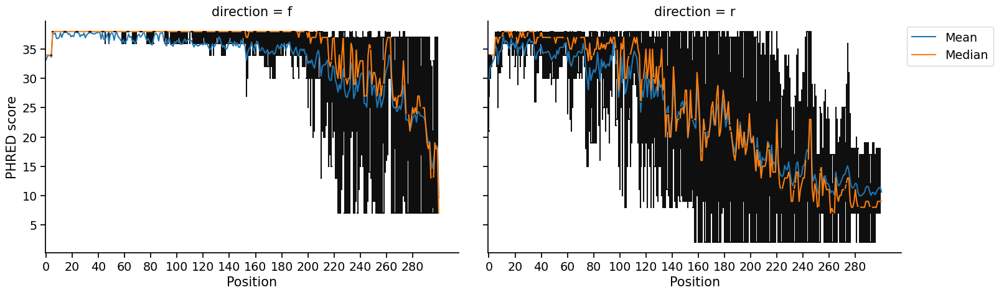
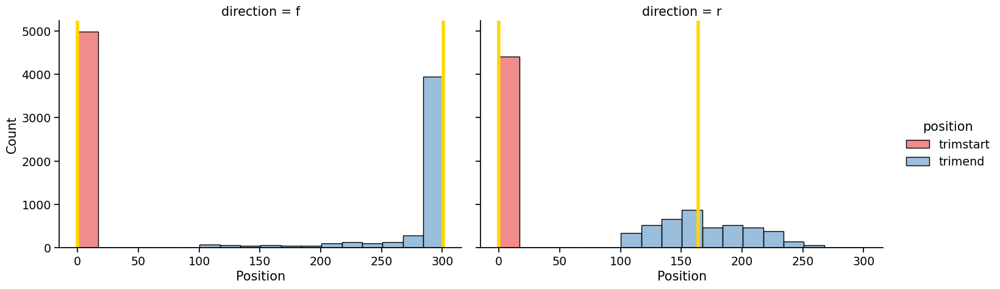

# minEER - A sensible sequence trimming algorithm

 For a given quality annotated read, the minEER algorithm identifies the subsequence which <u>**m**</u>inimizes the <u>**e**</u>xpected <u>**e**</u>rror <u>**r**</u>ate (EER; the mean q-score) while maximizing the subsequence length according to user defined EER and minimum sequence length thresholds. This procedure mimics the manual exercise of choosing truncation positions by glancing at a quality profile distribution, but ensures consistent results and is fast (can run on 20,000 files in under 15s). The minEER algorithm offers an improvement to current heuristic methods (sliding windows, quality score drop offs, etc.) which can be sensitive to noise and miss the opportunity for a deterministic solution based on reasonable criteria. The algorithm itself can be seen [here](mineer/mineer.py).

The minEER pipeline (see documentation with `mineer -h` after installing) operates on an entire set of files from a single project. Assuming that all reads from a given direction (forward or reverse for paired reads) share a "similar" quality profile, the minEER pipeline runs the algorithm on a subsample of reads and to determine global truncation positions (where to start and end each read). All reads are then truncated according to these global positions and reads that fail to meet the user defined EER and minimum sequence lenght thresholds.

# Install
Install with pip install mineer and then run mineer -h to view the input documentation and to test that installation worked properly.

# Tutorial
After installing `mineer`, run the following:

    # Download some fastq files to `sample_files/`
    mineer-test-files
    # Run the pipeline with default parameters (minimal acceptable error=.01)
    mineer -i sample_files -f _1.fastq -r _2.fastq -n 5000 -o test_out -v sample_figs

Once you run the pipeline, a report of each step will appear as they execute. Files containing truncated reads will appear in the directory specified with `-o`. Providing the `-v` flag will produce visualizations like the following of quality profiles of untrimmed reads and the distribution of truncation positions identified by minEER:

# Pipeline

Method:

1. Ingest files and recognize pairs based on file names
2. Run minEER on subset of reads
3. Determine global truncation positions
4. Truncate all reads to global positions and filter out read pairs that don't pass QC (currently requires longest length)
5. Save truncated sequences
6. Produce visualizations, if visualization output directory provided

# Contributing
Run tests with `python -m unittest` or `pytest`

Here is a longer list of SRRs to test on:

    SRR9660346
    SRR9660368
    SRR9660375
    SRR9660380
    SRR9660372
    SRR9660321
    SRR9660322
    SRR9660307
    SRR9660387
    SRR9660385
